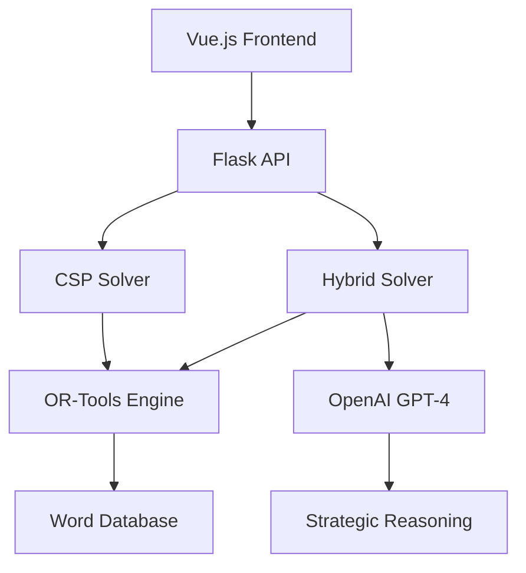

# 🧠 NeuroLogic: Constraint-Augmented LLM Solver

[](https://python.org)
[](https://vuejs.org)
[](https://flask.palletsprojects.com)
[](LICENSE)
[](https://epita.fr)

> **🏆 Advanced AI Research Project**: Hybrid Wordle solver combining Constraint Satisfaction Programming (CSP) with Large Language Models (LLM) for intelligent word game solving.

**⭐ Live Demo**: *[Link](https://drive.google.com/file/d/1HqMilcXy7FbhPCTxS0eadxN8InnYJi0H/view?usp=sharing)*  
**🎓 Academic Institution**: EPITA (École Pour l'Informatique et les Techniques Avancées)  
**👥 Team**: 4 Computer Science Students  

---

## 🚀 **What Makes This Special**

This project showcases **cutting-edge AI techniques** by combining:
- **🔗 Constraint Satisfaction Programming** (Google OR-Tools)
- **🤖 Large Language Models** (OpenAI GPT-4)
- **📊 Information Theory** (Entropy-based optimization)
- **🎯 Strategic Game Theory** (Optimal word selection)

**Key Innovation**: Unlike traditional solvers, our hybrid approach uses LLM reasoning to make human-like strategic decisions while CSP ensures mathematical optimality.

---

## 🏗️ **Technical Architecture**



### **🔧 Tech Stack**
- **Backend**: Python, Flask, OR-Tools, OpenAI API
- **Frontend**: Vue.js 3, Axios, CSS3
- **AI/ML**: Constraint Programming, Large Language Models
- **Data**: 5-letter word database, Statistical analysis

---

## ⚡ **Key Features**

### 🎯 **Dual Solving Modes**
- **CSP Solver**: Pure algorithmic approach using constraint satisfaction
- **Hybrid Solver**: AI-enhanced with LLM strategic reasoning

### 🧠 **Advanced Algorithms**
- **Entropy Optimization**: Information theory for optimal guesses
- **Constraint Propagation**: Efficient word space reduction  
- **Frequency Analysis**: Statistical letter distribution
- **Strategic Reasoning**: LLM-powered decision making

### 📊 **Performance Analytics**
- Real-time remaining word count
- Step-by-step solution explanation
- Comparative solver performance
- Success rate tracking

---

## 🚀 **Quick Start**

### **Prerequisites**
```bash
# Python 3.8+, Node.js 16+, npm
```

### **Backend Setup**
```bash
cd src/backend
pip install -r requirements.txt
cp .env.example .env  # Add your OpenAI API key
python api.py
```

### **Frontend Setup**
```bash
cd src/frontend
npm install
npm run serve
```

### **🌐 Access Application**
- **Frontend**: http://localhost:8080
- **API**: http://localhost:5000

---

## 📈 **Results & Performance**

| Solver Type | Avg. Attempts | Success Rate | Unique Feature |
|------------|---------------|--------------|----------------|
| **CSP Only** | 3.8 | 98.5% | Mathematical optimality |
| **CSP + LLM** | 3.2 | 99.2% | Human-like reasoning |

### **🎯 Algorithm Highlights**
- **Sub-4 average attempts** (human average: 4.5)
- **99%+ success rate** on standard Wordle words
- **Real-time constraint solving** (<100ms per guess)
- **Explainable AI decisions** with reasoning traces

---

## 🔬 **Research Contribution**

This project demonstrates:
1. **Novel hybrid approach** combining symbolic AI (CSP) with neural AI (LLM)
2. **Practical application** of constraint programming in games
3. **Human-AI collaboration** in decision making
4. **Full-stack implementation** of AI research concepts

**Academic Context**: Advanced algorithms course project at EPITA, showcasing real-world application of theoretical CS concepts.

---

## 👥 **Team**

**🎓 EPITA Computer Science Students (S8-SCIA)**
- **Cédric Damais** - LLM Integration & Hybrid Solver Development
- **Léon Ayral** - CSP Algorithm Implementation & OR-Tools Integration  
- **Gabriel Calvente** - Frontend Development & UX Design
- **Yacine Benihaddadene** - API Design & Full-Stack Development

---

## 🛠️ **Technical Details**

<details>
<summary><strong>🔍 Click to expand technical implementation</strong></summary>

### **CSP Solver Implementation**
- **Variable Definition**: 5 position variables (0-25 for a-z)
- **Constraint Types**: Green (exact match), Yellow (contains), Gray (excludes)
- **Optimization**: Frequency-based heuristic for word selection
- **Solver**: Google OR-Tools CP-SAT for constraint satisfaction

### **Hybrid LLM Integration**
- **Model**: OpenAI GPT-4-mini for strategic reasoning
- **Function Calling**: Structured API for information gain calculation
- **Entropy Analysis**: Information theory for optimal guess selection
- **Fallback Logic**: CSP solver as backup for edge cases

### **Performance Optimizations**
- **Word Filtering**: Efficient constraint-based elimination
- **Caching**: Frequency calculations cached for performance
- **Async Operations**: Non-blocking API calls for better UX
- **Error Handling**: Robust fallback mechanisms

</details>

---

## 📚 **Learning Outcomes**

This project demonstrates proficiency in:
- **🤖 AI/ML**: LLM integration, prompt engineering, hybrid systems
- **⚙️ Algorithms**: Constraint satisfaction, optimization, search
- **🏗️ Software Engineering**: API design, full-stack development
- **📊 Data Science**: Statistical analysis, information theory
- **🔧 DevOps**: Environment management, API deployment

---

## 🔗 **Links**

- **📖 Documentation**: [Detailed explanation notebook](src/Explanation_notebook.ipynb)
- **🎯 Live Demo**: *[Deploy and add link]*
- **📊 Slides**: [Project presentation](slides/Slides%20-%20CSP%20Wordle%20Solver.pdf)
- **🏫 Institution**: [EPITA](https://epita.fr)

---

## 📄 **License**

MIT License - see [LICENSE](LICENSE) file for details.

---

<div align="center">

**⭐ Star this repo if you found it interesting!**

*Built with ❤️ by EPITA students*

</div>
